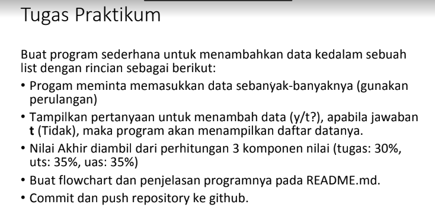

# latihan
## soal

Pada modul praktikum 4 saya diberi soal seperti dibawah :

## jawab
pertama saya membuat list dengan 5 elemen saya membuat list

```py
hewan =["harimau","singa","cheetah","serigala","sapi"]
```

kedua pada akses list saya diberi 3 soalan\
```py
1. menampilkan elemen ke 3\
2. ambil nilai elemen ke 2 sampai elemen ke 4\
3. ambil elemen terakhir\
```
dari soal diatas saya mengerjakan dengan cara sebagai berikut :
```py
print('elemen ke 3 adalah', hewan[2])
del hewan[1:4]
print('setelah nilai elemen ke 2 sampai ke 4 diambil maka akan menjadi', hewan)
del hewan[1]
print('setelah elemen terakhir diambil maka akan mejadi', hewan)
```
ketiga pada ubah elemen list saya diberikan 2 soalan
```py
1. ubah elemen ke 4 dengan nilai lainnya
2. ubah elemen ke 4 sampai dengan elemen terakhir
```
dari soalan diatas saya menjawab dengan cara sebagai berikut :
```py
print('\nubah list')
hewan =["harimau","singa","cheetah","serigala","sapi"]
hewan[3]=8
print('setelah nilai elemen ke 4 diubah maka akan menjadi', hewan)
hewan[3:]=9,5
print('setelah nilai elemen ke 4 dan terakhir diubah maka akan menjadi', hewan)
```
terakhir pada tambah elemen list saya diberi soalan sebagai berikut
```py
1. ambil 2 bagian dari list pertama (A) dan jadikan list ke 2 (B)
2. tambah list B dengan nilai string
3. tambah list B dengan 3 nilai
4. gabungkan list dengan list A
```
dari soal diatas saya menjawab dengan cara sebagai berikut :
```py
print('\ntambah list')
hewanA =["harimau","singa","cheetah","serigala","sapi"]
hewanB=[]
hewanB.extend(hewanA[:2])
print('setelah list pertama diambil 2 bagian dan dijadikan list kedua maka akan menjadi', hewanB)
hewanB.append("7")
print('setelah list B ditambahkan dengan nilai string akan menjadi', hewanB)
hewanB.extend(["4","6","9"])
print('pada list B ditambahkan 3 nilai akan menjadi',hewanB)
h =hewanB+hewanA
print('setelah list B dengan list A digabungkan maka akan menjadi', h)
```
berikut ini adalah screenshot pada visual studio code


## output
berikut output dari program diatas


# Tugas praktikum

## soal


## Flowchart
Pertama sebelum membuat program saya membuat flowchart terlebih dahulu.
Berikut flowchart yang telah dibuat


## Jawab
pertama saya membuat inputan dan looping agar program terus berjalan
```py
B={}
while True :
    E=input('apakah ingin menambahkan data? y/t : ')
```
lalu saya membuat fungsi if apabila menginput 'y'
```py
    if E=="y" :
        print()
        print("tambah data mahasiswa")
        print('\n')
        Nama=input("masukan nama : ")
        NIM=input("masukan NIM : ")
        Nilaitugas=int(input("masukan nilai tugas : "))
        NilaiUTS=int(input("masukan nilai UTS : "))
        NilaiUAS=int(input("masukan nilai UAS : "))
        Nilaiakhir=(0.30*Nilaitugas)+(0.35*NilaiUTS)+(0.35*NilaiUAS)
        B[Nama]=NIM,Nilaitugas,NilaiUAS,NilaiUTS,Nilaiakhir
        print('data berhasil ditambahkan')
```
saya juga membuat percabangan if apabila menginput 't'
```py
    elif E=="t" :
        if B.items():                                                                     
            print("\n                      DAFTAR NILAI MAHASISWA                    ")
            print("==================================================================")
            print("| No |     Nama     |    NIM    | Tugas |  UTS  |  UAS  |  Akhir |")
            print("==================================================================")
            i = 0
            for x in B.items():
                i += 1
                print("| {6:2} | {0:12s} | {1:9s} | {2:5} | {3:5} | {4:5} | {5:6} |".format(x[0], x[1][0], x[1][1], x[1][2], x[1][3], x[1][4], i))  
            print("==================================================================")
        else:
            print("\n                      DAFTAR NILAI MAHASISWA                    ")
            print("==================================================================")
            print("| No |     Nama     |    NIM    | Tugas |  UTS  |  UAS  |  Akhir |")
            print("==================================================================")
            print("|                          TIDAK ADA DATA!                       |")
            print("==================================================================")
```
dan saya menambahkan else untuk menyetop loopingan yang saya buat tadi
```py
    else:
        break  
```
dari program diatas berikut screenshot pada visual studio code :


## output
dari program diatas saya mendapatkan output sebagai berikut :


## Nama  : Ridwan abdulah
## NIM   : 312110369
## Kelas : T1 21 C5